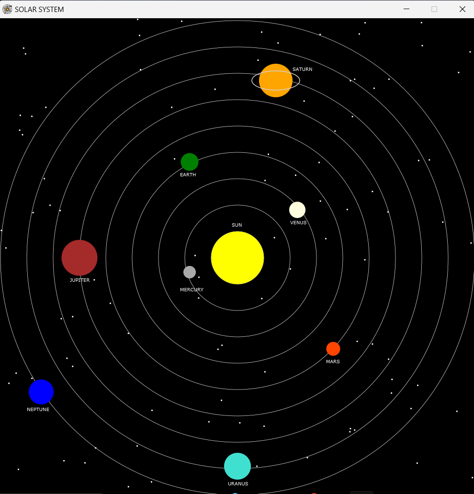

#JavaFX 2D Solar System

This is a simple 2D solar system animated model using javaFX.

---

## Features

- 9 planets with custom positions, size, and colors (details according to NASA)
- Sun in the center
- Orbit paths for each planet
- Saturn with rings
- stars in the background

---

## Demo

---

